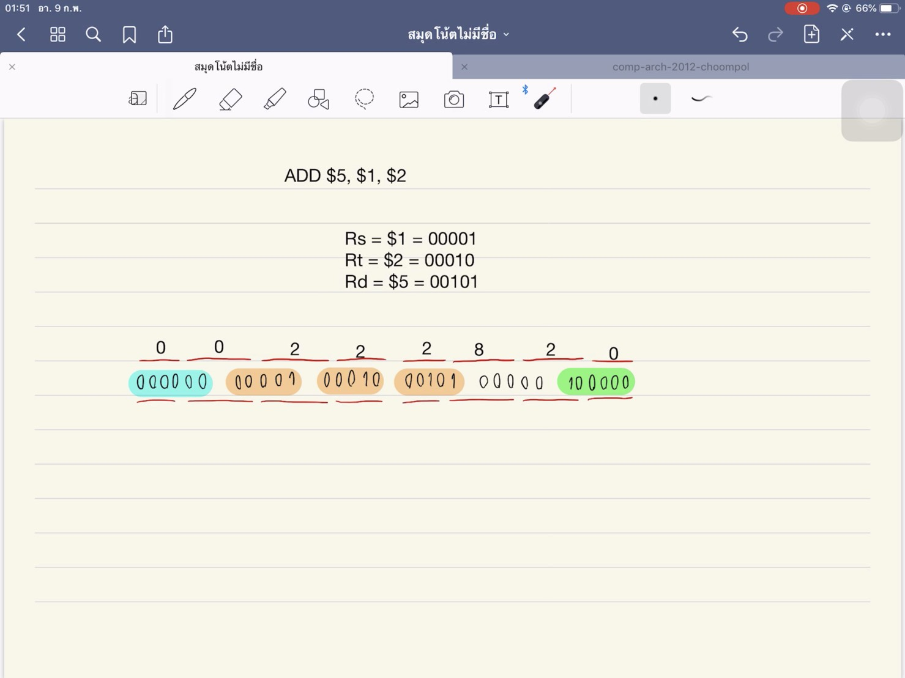

# All Work
## CLIP1
**คลิปที่ 1 อธิบายคำสั่ง ADD ใน MIPs**

  เป็นคลิปอธิบายเกี่ยวกับคำสั่ง ADD ใน MIPs ซึ่งคำสั่ง ADD ถือเป็นหนึ่งในคำสั่งประเภท R-Type หรือคำสั่งที่ใช้ในการคำนวณทางคณิตศาสตร์
คำสั่ง ADD คือคำสั่งที่ใช้บวกเลข โดยข้อมูลของคำสั่งจะถูกเขียนในรูปเลขฐาน 2 แบ่งเป็น

1. Opcode มี 6 bits
2. Register Rs มี 5 bits
3. Register Rt มี 5 bits
4. Register Rd มี 5 bits
5. Shift มี 5 bits
6. Func มี 6 bits

  รวมกันทั้งหมด 32 bits การทำงานของคำสั่งคือจะนำข้อมูลที่เก็บใน Register Rs มาบวกกับ Register Rt แล้วนำค่าที่ได้ไปเก็บไว้ใน Register Rd
{คลิปวิดีโอ} [CLIP1](https://youtu.be/5Rgjj3vCG_s)
## CLIP2
**คลิปที่ 2 อธิบายการทำงานของ CPU MIPs**
## CLIP3
**คลิปที่ 3 ความแตกต่างระหว่าง Single-cycle กับ Multi-cycle Processor**
## CLIP4
**คลิปที่ 4 อธิบายการทำงานคำสั่ง lw ใน Multi-cycle Processor**
## CLIP5
**คลิปที่ 5 อธิบายการทำงานคำสั่ง beq ใน Multi-cycle Processor**
## CLIP6
**คลิปที่ 6 อธิบายคำสั่ง R-Type ใน state machine แบบ multicycle**
## CLIP7
**คลิปที่ 7 อธิบายการทำงานแบบ Pipelining**
