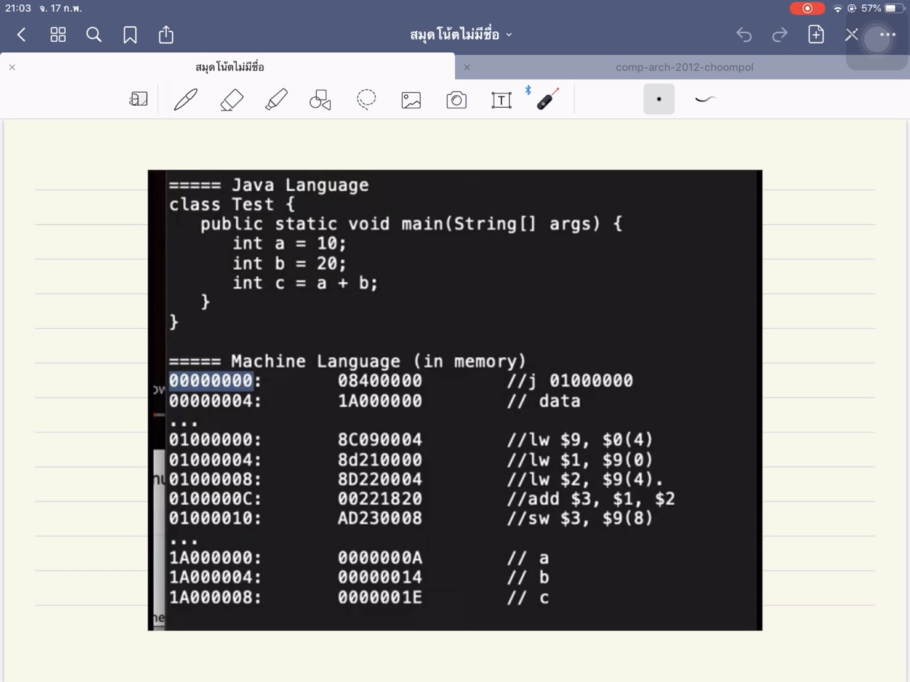
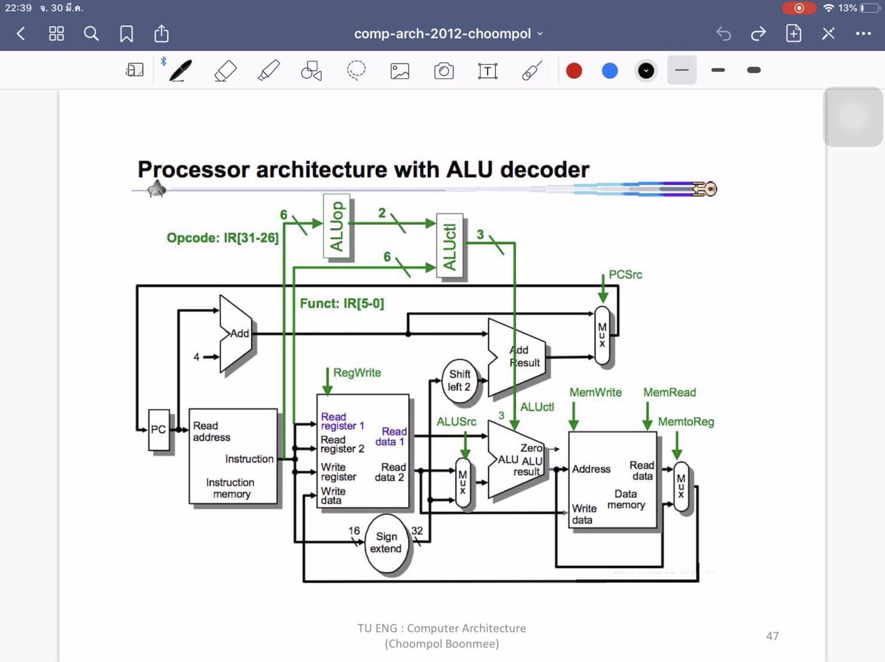
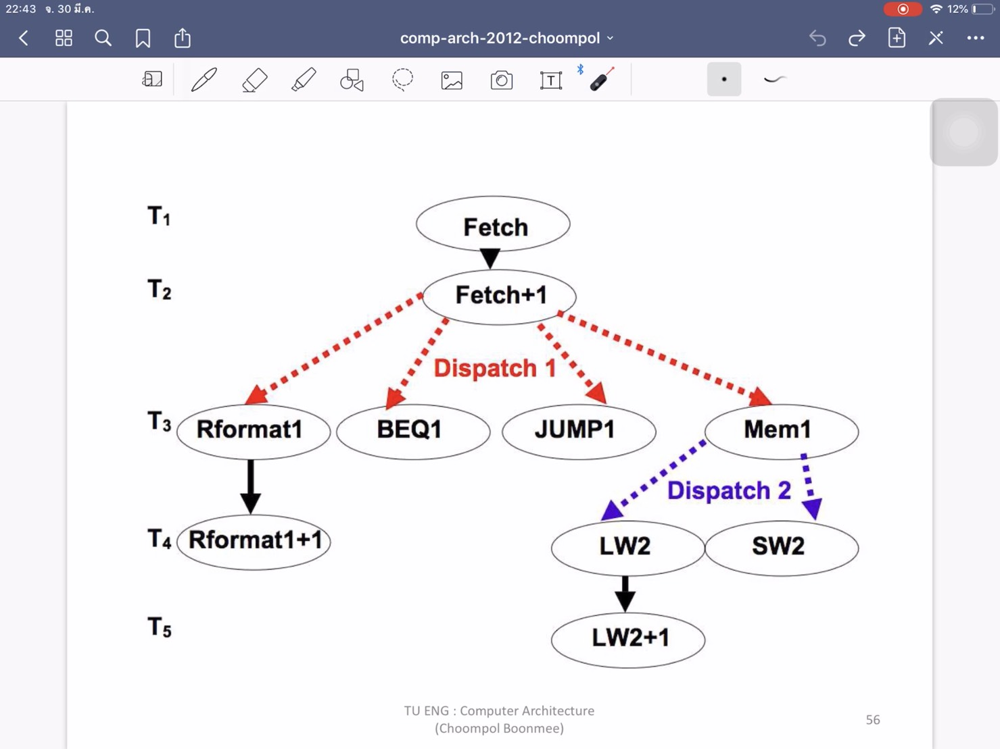
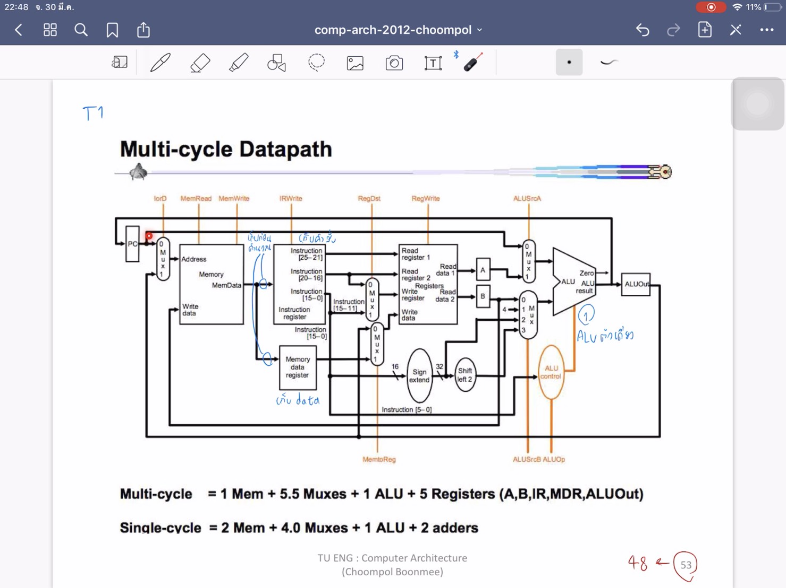
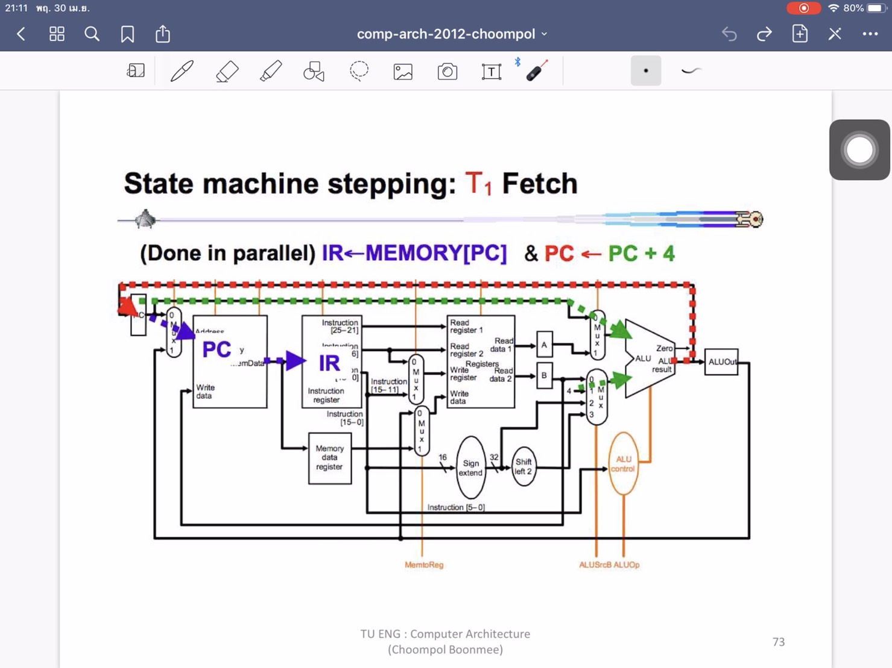
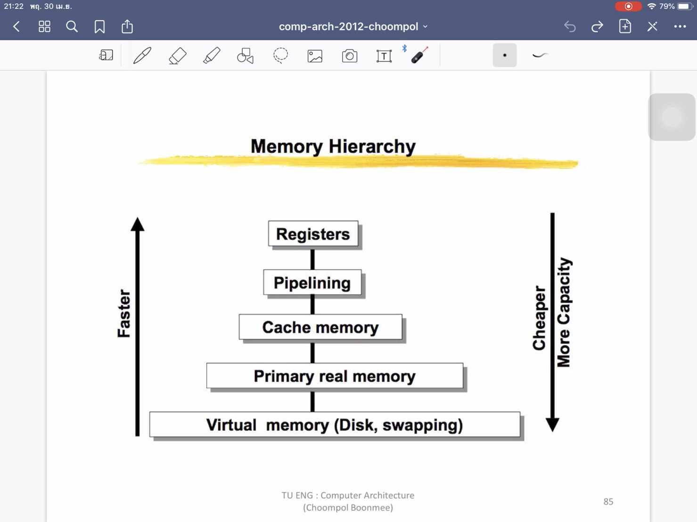
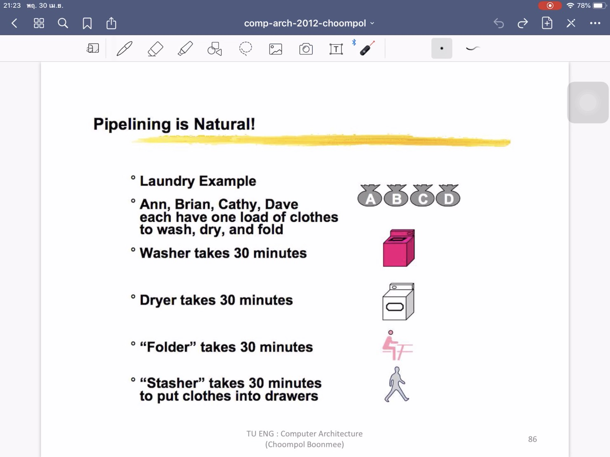
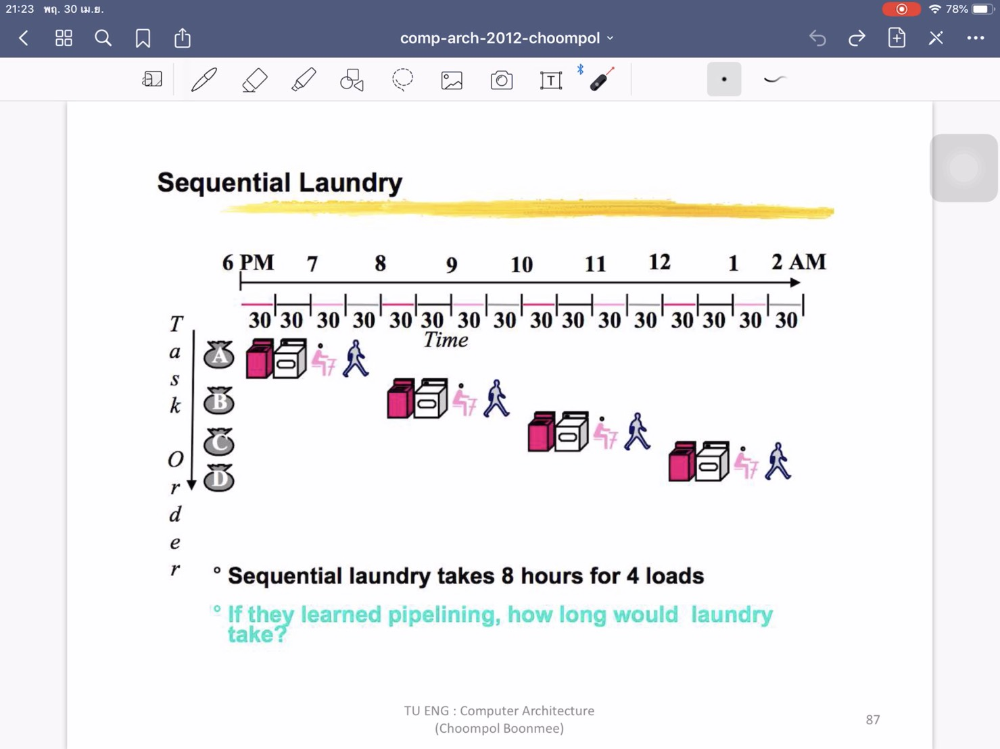
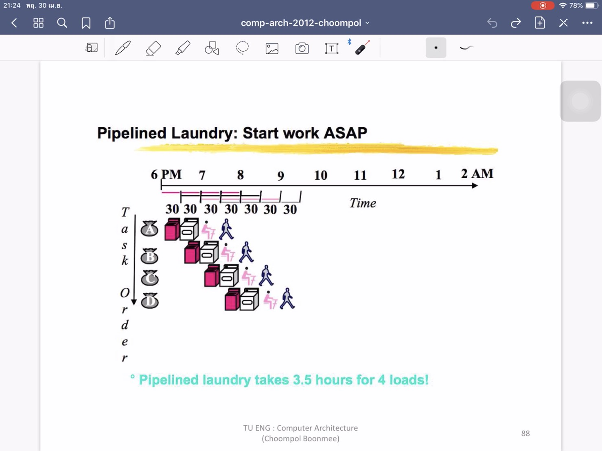

# All Work
## CLIP1
**คลิปที่ 1 อธิบายคำสั่ง ADD ใน MIPs**

  เป็นคลิปอธิบายเกี่ยวกับคำสั่ง ADD ใน MIPs ซึ่งคำสั่ง ADD ถือเป็นหนึ่งในคำสั่งประเภท R-Type หรือคำสั่งที่ใช้ในการคำนวณทางคณิตศาสตร์
คำสั่ง ADD คือคำสั่งที่ใช้บวกเลข โดยข้อมูลของคำสั่งจะถูกเขียนในรูปเลขฐาน 2 แบ่งเป็น

1. Opcode มี 6 bits
2. Register Rs มี 5 bits
3. Register Rt มี 5 bits
4. Register Rd มี 5 bits
5. Shift มี 5 bits
6. Func มี 6 bits

  รวมกันทั้งหมด 32 bits การทำงานของคำสั่งคือจะนำข้อมูลที่เก็บใน Register Rs มาบวกกับ Register Rt แล้วนำค่าที่ได้ไปเก็บไว้ใน Register Rd

คลิปวิดีโอ: [CLIP1](https://youtu.be/5Rgjj3vCG_s)

## CLIP2
**คลิปที่ 2 อธิบายการทำงานของ CPU MIPs**

  เป็นคลิปอธิบายการทำงานของ CPU MIPs ซึ่งจะมีการแสดงให้เห็นคำสั่งทั้งในรูปแบบ Machine language และ Assembly language

  ในคลิปนี่้จะยกตัวอย่างการทำงานของคำสั่ง ADD มา โดยเริ่มจากเมื่อคอมพิวเตอร์เปิดเครื่องมา จะทำงานคำสั่งในตำแหน่ง 000000 ที่มีการสั่ง Jump ไปยังคำสั่งถัดไป
แล้วก็จะทำงานทีละคำสั่งเรียงไปเรื่อยๆทีละขั้นตั้งแต่ lw add sw จนจบการทำงาน

คลิปวิดีโอ: [CLIP2](https://youtu.be/uHqFkaDj0BA)

## CLIP3
**คลิปที่ 3 ความแตกต่างระหว่าง Single-cycle กับ Multi-cycle Processor**

  เป็นคลิปอธิบายความแตกต่างระหว่าง Single-cycle กับ Multi-cycle Processor ดังนี้

  Single-cycle Processor
* มีการทำงานลูปเดียว
* มี Memory 2 ส่วน คือ Instruction memory และ Data memory
* มี ALU 3 ตัว

  Multi-cycle Processor
* มีการทำงานหลายลูป
* มี Memory ส่วนเดียว
* มี ALU ตัวเดียว

  และ Multi-cycle จะทำงานได้เร็วกว่า Single-cycle Processor

คลิปวิดีโอ: [CLIP3](https://youtu.be/EC8kAC64zO4)

## CLIP4
**คลิปที่ 4 อธิบายการทำงานคำสั่ง lw ใน Multi-cycle Processor**

  เป็นคลิปอธิบายการทำงานของคำสั่ง lw ใน Multi-cycle Processor แบ่งเป็น 5 ขั้นตอน คือ T1.Fetch T2.Fetch+1 T3.Mem1 T4.Lw2 T5.Lw2+1
โดยจะอธิบายเรียงไปเรื่อยๆตั้งแต่การดึง PC มาทำงาน ไปจนวนจบครบลูปการทำงาน

คลิปวิดีโอ: [CLIP4](https://youtu.be/JZhdv7kZJxI)

## CLIP5
**คลิปที่ 5 อธิบายการทำงานคำสั่ง beq ใน Multi-cycle Processor**

  เป็นคลิปอธิบายการทำงานของคำสั่ง beq ใน Multi-cycle Processor แบ่งเป็น 3 ขั้นตอน คือ T1.Fetch T2.Fetch+1 T3.Beq1
โดยจะอธิบายเรียงไปเรื่อยๆตั้งแต่การดึง PC มาทำงาน ไปจนวนจบครบลูปการทำงาน

คลิปวิดีโอ: [CLIP5](https://youtu.be/RLFbzrB3c8o)

## CLIP6
**คลิปที่ 6 อธิบายคำสั่ง R-Type ใน state machine แบบ multicycle**

  เป็นคลิปอธิบายคำสั่ง R-Type ใน state machine แบบ multicycle แบ่งเป็น 4 ขั้นตอน คือ T1.Fetch T2.Decode T3.ExecALU T4.WrReg
โดยในคลิปนี้จะมีการแสดงคำสั่งแบบ state machine ให้ดูด้วย และมีคำอธิบายว่าคำสั่งไหน จะมีการทำงานอย่างไร เช่น
ในขั้นตอน T1 จะมี MemRead=1 lorD=1(นำ PC ไปเก็บไว้ใน MemAddr) IRWrite=1(นำ Mem[PC] ไปเก็บไว้ที่ IR) ALUSrcA=0(ให้ A=PC) ALUSrcB=1(ให้ B=4)
ALUOP=ADD(นำ PC+4 ไปเก็บเป็นค่า PC อีกที) PCWrite=1,PCSource=1(=ALU) เป็นต้น

คลิปวิดีโอ: [CLIP6](https://youtu.be/D7IzASGrkzw)

## CLIP7
**คลิปที่ 7 อธิบายการทำงานแบบ Pipelining**

  เป็นคลิปอธิบายการทำงานแบบ Pipelining โดย Pipelining นี้จะมีความเร็วของการทำงานที่ช้ากว่า Register แต่สามารถเก็บข้อมูลได้มากกว่า
โดยหลักการทำงานนั้นจะเปรียบเทียบผ่านการซักผ้า คือ ในการซักผ้าที่มีหลายขั้นตอน ถ้าซักผ้าหลายถัง แล้วรอจบขั้นตอนทั้งหมดแล้วค่อยซักถังถัดไป ก็จะใช้เวลานาน
แต่ถ้าระหว่างที่ถังหนึ่งเราซักเสร็จแล้ว ไปสู่ขั้นตอนการอบ ระหว่างที่เราอบอยู่ เราก็นำผ้าถังถัดไปมาซักเลย ก็จะลดระยะเวลาในการทำงานได้

คลิปวิดีโอ: [CLIP7](https://youtu.be/TmCCdlvf6eM)
